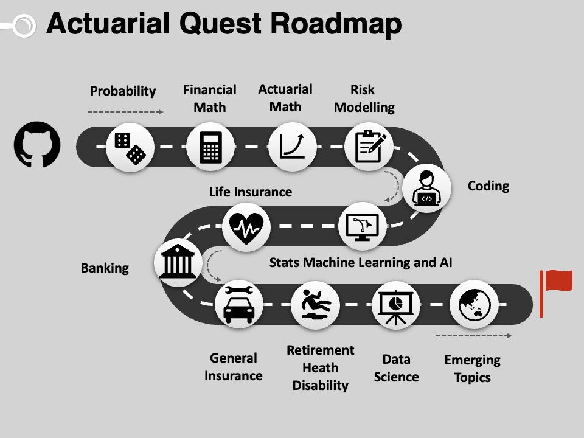

# Introduction to Actuarial Studies 

_"Tell me and I forget. Teach me and I remember. Involve me and I learn" - Benjamin Franklin_

---

### Congrats on completing the ACTL1101!

>Now it's time to build your own website to showcase your work.  
>To create a website on GitHub Pages to showcase your work is very easy.

This is written in markdown language. 
>
* Click [link](https://classroom.github.com/a/urlUeIOS) to accept your assignment.

* [Probability](probability.md)
* [Financial Mathematics](financial_math.md)
* [Life Insurance and Annuity](life.md)
* [Risk and Insurance](risk.md)
* [Statistical Machine Learning and AI](statsml.md)
* [Retirement and Health](super.md)
* [General Insurance](general.md)
* [Banking and ERM](banking.md)
* Coding Assignment: [Algorithmic Trading](algotrading.md) <- filled this
* Coding Assignment: [CAPM Model](capm.md) <- filled this

---
**Testimonial:**

**Yipu Zhai:** (Change to your name)

Throughout ACTL1101, I have mastered the topics listed in principles of actuarial science, and the coding assignment work is mine. I feel much more prepared for my future career.

😄😄😄
