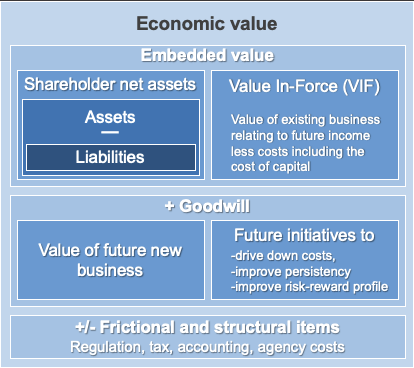

# Banking

---

## Motivation

### Actuaries in Banking

- Actuaries work across a range of banking roles:
  - Front-office investment banking (19%)
  - Middle-office finance (17%)
  - Credit risk related roles (19%)

- Motivations for a Banking Career:
  - Broader career opportunities (31%)
  - Variety of work (26%) compared to traditional areas
  - Reflected in the wide range of current roles of survey respondents

## ERM and Risk Classification

### Risks Faced by Organizations

- The possibility of events (or combinations of events) occurring which have an adverse impact on the economic value of an enterprise.
- What is the 'economic value' of an enterprise?

---

### Risk Classification (ERM)

Enterprise Risk Management - Risk Classification 

### Introduction to Risk Categories

- **Credit Risk:** The risk of loss from a counterparty's failure to meet contractual obligations (including failure to perform them in a timely manner).

- **Market Risk:** As a result of market movements, a firm may be exposed to fluctuations in the value of its assets, liabilities, or income from its assets.

- **Operational Risk:** The risk of loss, resulting from inadequate or failed internal processes, people and systems, or from external events.

---

### Introduction to Risk Categories - 2

- **Insurance and Demographic Risk:** The risk of adverse variation in life and general insurer and pension fund claim experience as well as more general exposure to adverse persistency and other demographic experience.

- **Liquidity Risk:** The risk that a firm, although solvent, either does not have available sufficient financial resources to enable it to meet its obligations as they fall due, or can secure such resources only at excessive cost.

---

### Introduction to Risk Categories - 3

- **Strategy Risk:** Threats to the realization of the goodwill of a firm in relation to future new business and projects to extract greater value from existing business.

- **Frictional Risk:** The risk of changes in accounting and regulatory capital rules; inefficiencies in operating structure; the problems caused by intra-group exposures; and distortions and asymmetries caused by (changes in) tax.

- **Aggregation and Diversification Risk:** The risk that the aggregate of risks across individual categories is greater than the sum of the individual parts and/or that anticipated diversification benefits are not fully realized.

---

## Credit Risk

### Credit Risk

- The risk of loss a firm is exposed to if a counterparty fails to perform its contractual obligations.
  - Default does not necessarily mean legal bankruptcy.
  - Failure to fulfill contractual obligations in a timely manner due to inability or unwillingness.

### Credit Risk Categories

Can be identified by source of credit risk:

**1. Bonds:**
- Corporate bonds
- Structured bonds (RMBS, CMBS, ABS, CDOs)
- Quasi-government bonds (municipal, supra-national)
- Sovereign bonds

**2. Retail lending:**
- Retail mortgages
- Other secured retail lending
- Credit cards and overdrafts
- Other unsecured retail lending

**3. Corporate lending:**
- Commercial mortgages
- Other secured commercial lending (e.g., Asset finance, trade finance)
- SME unsecured lending
- Wholesale unsecured lending (e.g., syndicated loans)

4. Deposit counterparties
5. Money market counterparties
6. Tenant default
7. Over-the-counter (OTC) counterparty default
8. Derivative exchanges and clearing house counterparty default risk
9. Securities lending counterparty default risk
10. Dealing and settlement counterparty default risk
11. Custodian counterparty default risk (this should be mitigated by ring-fencing of assets from those of the custodian)
12. (Re)insurer default relating to default of an insurer and resulting loss of cover (as distinct from any loss on investment products issued by that insurer)

---

### Credit Risk Management

Effective management of credit risk is:
- A challenge faced by all companies
  - Both financial and non-financial institutions face credit risk exposures besides the default risk associated with lending activities 
  - Example: Account receivables, investment activities, and counterparty and business partner exposures are relevant to any industry.

- A critical success factor for financial institutions (banking institutions)
  - Approximately 80% of the average capital is held against credit risk
  - Risk that institutional and individual borrowers may default on loans
  - Must underwrite and price each loan according to its credit risk, ensuring the overall portfolio of loans is well diversified

### Traditional Approach to Credit Risk

Traditional banking calls for each exposure to be individually underwritten: **Four Cs of credit underwriting**:

- **Character:** Integrity: Check the business history of the counterparty
- **Capacity:** Ability of the counterparty to service the debt (principal and interest) on the exposure, with a focus on free cash flow
- **Capital:** Financial resources of the counterparty other than those arising from the loan itself
- **Conditions:** Exogenous factors applicable to the economy, industry, or region

Traditional banking calls for each exposure to be individually underwritten: **More Cs**:

- **Collateral:** Right to seize property or other assets if the counterparty defaults 
  - Should be viewed as an exit strategy, rather than an excuse for entering into a loan
  - The collateral rights can only be exercised if the counterparty doesn't have the capacity to service the debt

- **Covenants:**  Binding promises made by the counterparty to constrain its future behavior
  - Keeping total leverage within a prescribed max

### Modern Approach to Credit Risk

Credit Risk Management

- The identification, quantification, monitoring, controlling, and management of credit risk at both the transaction and portfolio level

- The level and volatility of future losses are inherently uncertain 

- Use statistical analysis and models to quantify losses as input to underwriting, pricing, and portfolio decisions

- Probabilistic approach: losses are considered to be stochastic, actual losses are expected to follow a probability distribution

### Key Credit Risk Concept

**Loss = Default x Severity x Exposure**

- **Loss:** Actual economic loss to the organization as a result of a credit event

- **Default:** Random variable - either 1 or 0 (single counterparty/transaction) / represent overall default rate of a portfolio 

- **Severity:** The fraction of the total exposure that is actually lost (can be reduced by collateral arrangements, debt covenants, etc.)

- **Exposure:** The loan amount or market value of securities that the organization is due to receive from the counterparty at the time of the credit event

### Expected Loss (EL)

**Expected Loss (EL):** Anticipated average rate of loss (reasonably predictable) that an organization should expect to suffer on its credit risk portfolio over time
- Effectively a cost of doing business
- Should be reflected directly in transaction pricing (don't need to hold capital against EL) 

$$
\text{Expected Loss (EL)} = \text{PD} \times \text{LGD} \times \text{EAD}
$$

- Probability of Default (PD): Expected default frequency
- Loss Given Default (LGD): 'Severity', net loss in the event of default
- Exposure at Default (EAD): Expected exposure at the time of the credit event

### Probability of Default (PD)

**Expected default frequency:**

- Probability that an obligor will default before the maturity
- Reflect the underlying credit risks of the particular counterparty
- Derived from observed defaults, reference data sets, counterparty's credit rating, statistical models

### Loss Given Default (LGD)

**Net loss in the event of default**

- Economic loss: lost principal and interest + recovery and transaction costs + delays
- Expressed as a percentage of the exposure at the point of default
- A function of facility type (e.g., bank loans, bonds), seniority (e.g., senior bond, junior bond) and collateral (e.g., secured bond, unsecured bond)
- Recovery rates for publicly traded bonds can be obtained from the major rating agencies (e.g., if recovery rate = 60%, then LGD = 40%); other facilities and transactions - few public data, must be estimated from firm's own recovery data

### Exposure at Default (EAD)

**Expected exposure at the time of the credit event**   

- Depends on the type of transaction and on the occurrence of future random events
- Loans: Usually outstanding amount 
- Trading exposures: Expected exposure needs to be modeled (e.g., expected exposures of long-dated transactions - swaps or forwards)

### Expected Loss - Example

- A $10 million one-year loan with a credit rating of 'BB' by S&P. The loan is collateralized with real estate.
- The probability of default derived from the credit rating is 0.72%.
- The loss in the event of a default for a similar loan is estimated at 60%.
- What is the expected credit loss?

$$
\text{Expected Loss (EL)} = \text{PD} \times \text{LGD} \times \text{EAD}
$$

$$
= 0.72\% \times 60\% \times \$10 \text{ million}
$$

$$
= \$43,200
$$

### Unexpected Loss (UL)

**The standard deviation ($\sigma$) of credit losses**

- More important measure of risk than EL
- Represents the **volatility of actual losses** that will occur around the expected level
- Existence of UL creates the need for a capital 'cushion' to safeguard the viability of the organization if losses turn out to be unexpectedly high
- Some UL are SO unlikely - uneconomic to hold capital against them (sets the risk of failure a firm is willing to tolerate)

### Credit Risk Models

- **Credit rating**: Issued by credit rating agencies like Moody's, S&P, Fitch
- **Credit scoring**: Binomial classification system - score $\geq$ discrimination threshold $\rightarrow$ take action (e.g., extend credit)
- **Structural models**: Based on the structure of a company's balance sheet
- **Reduced form models**: Estimating default probabilities with a broad array of explanatory variables, including macro-economic factors
- **Credit migration models**: Consider the risk that an investment will lose (or gain) value due to changes in the corporation's credit rating

