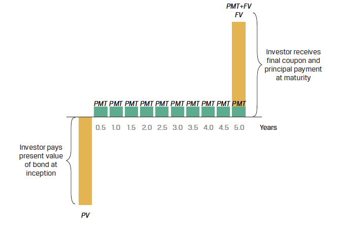

# Financial Mathematics

## Introduction and Motivation

### Motivation

From the [Actuaries Institute](https://www.actuaries.asn.au/becoming-an-actuary/):

> "Actuaries evaluate risk and opportunity - applying mathematical, statistical, economic and financial analyses to a wide range of business problems."

A key concept here is **financial**; most of an actuary's work relates in some way or another to money, such as insurance claims, superannuation benefits, investment returns, etc. Understanding the **time value of money** is crucial: $1,000 today does not hold the same value as $1,000 in 20 years...

### Overview

Financial mathematics are typically not an end in itself but a **fundamental tool** that actuaries need. This week covers the valuation of **known** future cash-flows. Another difficulty in actuarial studies is that cash flows related to losses are by nature **uncertain**. In-depth coverage is provided in the course ACTL2111: Financial Mathematics.

Historically, actuaries developed the application of the mathematics of finance to insurance problems as early as the 1700s.

### Some Applications

1. **Personal and Housing Loans**
   - Personal loan - usually with level repayments, "flat" fixed interest rates (3 to 5 years)
   - Housing loan - level repayments of loan principal and interest (20 to 30 years), variable interest rates in Australia, flexible repayments

2. **Fixed and Floating Interest Securities (Bonds)**
   - Repayments of interest (coupons) and face value on maturity
   - Includes government bonds, corporate bonds

## Compound Interest

"Money makes money. And the money that money makes, makes money." - Benjamin Franklin

"The most powerful force in the universe is compound interest." - Albert Einstein (possibly apocryphal, see [Snopes](https://www.snopes.com/fact-check/compound-interest/))

### Definitions

- **Nominal Interest Rate** - Interest rates are normally **QUOTED** as per annum percentage nominal rates.
- **Effective Interest Rate per Period** - Let $j^{(m)}$ denote the per annum nominal interest rate with $m$ periods. The effective interest rate per period is calculated as:
  $r = \frac{j^{(m)}}{m}$

### Continuous Compounding

- The `continuously compounded interest rate` is the nominal interest rate obtained when the compounding frequency is increased to infinity.
- Known as the **force of interest**, with the mathematical constant $e$ discovered by Jacob Bernoulli in 1683.
- For an annual effective rate of 10% p.a., the continuously compounded interest rate is approximately 9.530%, calculated as:
  
```math
\delta = \ln[1 + j] = \ln[1.1] = 0.09531
```

## Annuities and Actuarial Notation

### Time Certain Annuity

A **time certain annuity** is a stream of level payments, happening at regular intervals. Assuming a constant interest rate, the symbol $a\_{\overline{n}\|}$ represents the Present Value (PV) of $n$ payments of 1, payable in arrears (at the end of each period).
- Let $i$ be the interest rate effective per period.

The computation of $a_{\overline{n}\|}$ can be expressed as:
```math
a_{\overline{n}|} = \sum_{j=1}^{n}\left(\frac{1}{1+i}\right)^j
= \frac{1}{1+i} \left[\frac{1-\left(\frac{1}{1+i}\right)^n}{1-\left(\frac{1}{1+i}\right)}\right]
= \frac{1-\left(\frac{1}{1+i}\right)^n}{i}
= \frac{1-v^n}{i}, \text{where } v \equiv \frac{1}{1+i}
```
### Time Certain Annuity - Example

**Example 4.7:** Calculate $a_{\overline{n}\|}$ at an interest rate of $i = 0.01$ per period.

**Solution:**
```math
a_{\overline{n}|} = \frac{1-v^n}{i}
= \frac{1-\left(\frac{1}{1.01}\right)^{10}}{0.01}
= 9.4713
```

### Annuity Due - Payments in Advance
- Actuarial notation: place "double-dots" over the annuity symbol to indicate \(n\) payments made **in advance**: $\ddot{a}_{\overline{n}\|}$.
- This symbol  then represents the Present Value of $n$ payments of 1, if the first payment is made immediately:
  
```math
\ddot{a}_{\overline{n}|} = \sum_{j=0}^{n-1}(\frac{1}{1+i})^j
```

The relationship between $a_{\overline{n}\|}$ and $\ddot{a}_{\overline{n}\|}$ can be defined as:
```math
\ddot{a}_{\overline{n}|}  = \left[\frac{1-\left(\frac{1}{1+i}\right)^n}{1-\left(\frac{1}{1+i}\right)}\right]
= (1+i) \left[\frac{1-\left(\frac{1}{1+i}\right)^n}{i}\right]
= (1+i) a_{\overline{n}|}
```
But did we really need those calculations?

### Annuity Due - Example

**Example 4.8:** Calculate the present value of a 5 year annuity due at 6% per annum.

**Solution:**
```math
\ddot{a}_{\overline{n}|} = (1.06) \left[\frac{1-\left(\frac{1}{1.06}\right)^5}{0.06}\right]
= 4.4651
```

## Fixed-Income Instruments

### Types of Fixed-Income Instruments

Fixed-income instruments can be categorized into three main types:

- **Discount Instruments**: Examples include zero-coupon bonds.
- **Periodic Interest Instruments**: Examples include regular coupon bonds.
- **Level Payment Instruments**: Examples include mortgages.

> Source: CFA Level 1 Curriculum 2024: Quantitative Methods

### Time Value of Money Principles

The relationship between a current or present value (PV) and future value (FV) of a cash flow, given a discount rate \(r\) per period and \(t\) compounding periods, is defined as:

- **Future Value:**
```math
FV_t = PV \times (1 + r)^t
```

- **Present Value:**
```math
PV = \frac{FV_t}{(1 + r)^t}
```

When compounding continuously:
- **Future Value with Continuous Compounding:**
```math
FV_t = PV \times e^{rt}
```
- **Present Value with Continuous Compounding:**
```math
PV_t = FV \times e^{-rt}
```

### Coupon Bond Cash Flow Diagram

  
*Figure: Coupon Bond cash flow diagram.*

### Pricing a Coupon Bond

Pricing a coupon bond extends the single cash flow calculation for a discount bond to a general formula for calculating a bond's price (PV) given the market discount rate on a coupon date:

```math
PV_{\text{Coupon Bond}} = \frac{PMT_1}{(1 + r)^1} + \frac{PMT_2}{(1 + r)^2} + \ldots + \frac{PMT_N + FV_N}{(1 + r)^N}
```

This formula accounts for all periodic payments (PMT) and the final payment of the principal (FVN) at maturity.

### Republic of India Semiannual Coupon Bond - Overview

#### Bond Details

- **Duration**: 20 years
- **Coupon Rate**: 6.70% (Annualized)
- **Yield to Maturity (YTM)**: 6.70%
- **Payment Frequency**: Semiannual

#### Coupon Payments

- **Semiannual Payment (PMT)**: INR3.35 $(= 6.70/2)$
- **Periodic Discount Rate**: 3.35\% $(= 6.70/2)$

### Pricing Calculation

**Pricing at Issuance**:

- **Principal**: INR100

**Present Value Calculation**:

```math
PV = \frac{3.35}{1.0335} + \frac{3.35}{1.0335^2} + \ldots + \frac{103.35}{1.0335^{40}}
```

**Explanation**:

- Since the coupon rate equals the YTM, the present value (PV) of the bond at issuance is expected to be INR100.
- This calculation assumes that each coupon payment and the final principal are discounted back to their present value using the semiannual discount rate.

### Perpetual Bonds

A perpetual bond is a type of coupon bond with no stated maturity date, providing continuous cash flows indefinitely:

```math
PV_{\text{Perpetual Bond}} = \frac{PMT}{r}
```

This formula simplifies the present value calculation for perpetual bonds, assuming the rate $r$ is positive.

### Annuity Instruments: Mortgage Example

Fixed-income instruments with level payments, such as mortgages, combine interest and principal cash flows throughout their duration.


### Calculating Annuity Cash Flows

The periodic annuity cash flow (PMT), occurring at the end of each period, can be calculated using the formula:

```math
PMT = \frac{PV \cdot r}{1 - (1 + r)^{-t}}
```

Where:
- **PMT**: periodic cash flow
- **r**: market interest rate per period
- **PV**: present value or principal amount of the loan or bond
- **t**: number of payment periods

Using Actuarial Notations:
```math
\frac{PV}{PMT} =  a_{\overline{n}|}
```
Where:
- $i$ is the interest rate per period $(= r)$
- $n$ is the total number of payment periods $(= t)$

### Example: Mortgage Cash Flows

An investor seeks a fixed-rate 30-year mortgage loan to finance 80% of the purchase price of USD 1,000,000 for a residential building.

**Calculate the investor's monthly payment**:
- Annual mortgage rate: 5.25%
- Monthly rate $r$: $0.4375 = \frac{5.25}{12}$
- Number of payments $t$: 360
- Principal Value $PV$: $USD 800,000 = 0.8 \times USD 1,000,000$

```math
PMT = \text{USD } 4,417.63 = \frac{0.4375\% \times USD 800,000}{1 - (1 + 0.4375\%)^{-360}}
```

#### Interest and Principal Breakdown

**Month 1**:
- Interest: USD 3,500 = USD 800,000 $\times$ 0.4375\%
- Principal Amortization: USD 917.63 = USD 4,417.63 - USD 3,500
- Remaining Principal: USD 799,082.37 = USD 800,000 - USD 917.63

**Month 2**:
- Interest: USD 3,495.99 = USD 799,082.37 $\times$ 0.4375\%
- Principal Amortization: USD 921.64 = USD 4,417.63 - USD 3,495.99
- Remaining Principal: USD 798,160.73 = USD 799,082.37 - USD 921.64

Although the periodic payment is constant, the proportion of interest per payment declines, and the principal amortization rises over time.

