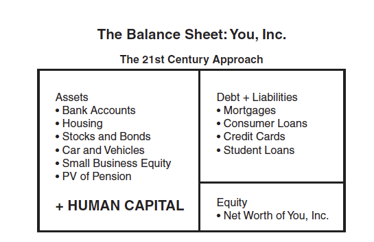

# Retirement, Health Care and Disability

---

## Superannuation Key Summary

- **Total Superannuation Assets:**
  - \$3.9 trillion at the end of the March 2024 quarter
- **Employer Contributions:**
  - \$133.3 billion for the year ending March 2024, 12.4% increase compared to the previous year
  - Influenced by Super Guarantee (SG) rate increase to 11% from 1 July 2023, employment growth, and higher wage inflation
- **Member Contributions:**
  - \$43.7 billion for the year ending March 2024, 8.2% increase compared to the previous year
- **Rate of Return:**
  - 4.9% for the March 2024 quarter
  - 10.9% for the year ending March 2024
  - Five-year average annualised ROR: 6.4%

## Retirement and Social Security

### Retirement and Social Security

- Insurance provides financial security in the event of death, injury, or damage to property.
- Major risks: longevity risk, health deterioration, unemployment.
- Social security benefits: income for retirement, unemployment, and other benefits.
- Financing: taxation system, specific levies, or overall tax revenue.

**Example 10.1:** How are health costs financed in Australia?
- Medicare provides coverage for hospital and medical treatment.
- Financing: partly from a direct Medicare levy, mostly from taxation revenue.

### Longevity Risk and Dependency Ratio

- Longevity risk: individuals live longer than average, requiring more resources post-retirement.
- Dependency ratio: increasing due to improved mortality and lower fertility rates.

$$
\text{Dependency Ratio} = \left( \frac{\text{No of Dependents}}{\text{Population Aged 15 to 64}} \right) \times 100
$$

- Example: OECD countries' dependency ratios expected to increase by 40% over the next 40 years.

## Retirement Income and Superannuation

### Retirement Income Arrangements

Types of retirement income arrangements:
- By provider: Publicly or Privately provided 
  - Publicly provided: Government provided benefits, funded from general revenue or social security taxes (generally publicly managed)
  - Publicly mandated: Government regulation requires compulsory private provision (generally privately managed) 
- By funding method: PAYG (pay-as-you-go) or Funded
  - PAYG: Benefits are paid out of current income (e.g. government general revenue or specific social security or payroll taxes, firms' profits)
  - Funded: Accumulation of assets to provide for future liabilities
- By benefit design: DB (defined benefit) or DC (defined contribution)

---

### Retirement Income in Australia

Australia's 'three-pillar' approach:
- Public Age Pension
- Compulsory Superannuation (Superannuation Guarantee)
- Voluntary Retirement Savings (Superannuation and other)

### Publicly provided PAYG pension

- **Eligibility:**
  - Qualifying age: 67 
  - Residence requirements: Australian resident for 10 years
  - Means-tested: Subject to income and assets tests

- **Coverage:**
  - Around 75% of people of Age Pension eligibility age receive Age Pension.

- **Benefits:**
  - Payments indexed 6 monthly.
  - Subject to income and assets tests.
  - Full pension rates (2024): \$26,535.6 (single)
  - The full Age Pension allows only a modest lifestyle for retiree homeowners in good health!

### Superannuation

Publicly mandated privately managed occupational pension system (predominantly DC)
- Mandatory employer contribution - 11.5% of an employee’s earnings (set to increase to 12%)
- Preserved benefits - generally superannuation can only be accessed when you reach a specific age (60)
- Concessionally taxed - concessional taxation of contributions fund income (earnings) and benefits
- Tax-free benefit payments for over 60
- Final benefits depend on various factors such as contributions, investment returns, fees, etc.

---

### Defined Benefit Funds

Feature: Retirement benefit is defined (by a pre-determined formula based on factors e.g. years of service, salary etc.)

**Example 10.4:** Main form of retirement benefit from a DB fund. 
- A common benefit for a superannuation fund paying a defined benefit would be a pension of:

$$
\frac{n \times \text{FAS}}{60}
$$

where \( n \) is the number of years of membership of the fund and FAS is the average salary over the (final) three years prior to retirement.

### DB Benefits Example

**Example:**
- A member with 40 years of service and salaries in the three years prior to retirement of \$80,000, \$85,000, and \$75,000 would receive a pension of:

$$
\frac{40 \times 80,000}{60} = 53,333 \text{ p.a.}
$$

- A member with 15 years of service would receive:

$$
\frac{15 \times 80,000}{60} = 20,000 \text{ p.a.}
$$

### Defined Benefit Fund Mechanics

- Trustees ensure the fund can pay defined benefits by requiring the employer or sponsor to contribute sufficient money.
- Contributions are determined by the fund actuary.
- Contributions and investment earnings must be sufficient to pay benefits under the Trust Deed.
- Benefits do not depend directly on the fund's investment returns.
- Risk of low investment earnings is met by the employer, who may make higher contributions in such cases.
- In theory, benefits may be reduced, but this is unlikely to be allowed by the Trustees.

### Defined Contribution Funds

Feature: Contribution is defined (by % of salary), retirement benefit depends on investment performance etc.

- The benefit payable on retirement is not defined.
- Determined by the amount that the contributions accumulate to, allowing for investment earnings, less charges for administration costs and the cost of death and disability cover.
- Usually provides life insurance charged against contributions.
- Governments usually provide favorable taxation treatment for superannuation savings (tax deferral).

### Taxation of Superannuation Funds in Australia

**Example 10.5:** How does the Australian government tax superannuation funds at present?

**Solution:**
- Contributions into superannuation funds are taxed at 15% as income of the fund.
- Individuals are taxed on contributions above a specified level as income.
- The investment income of the funds is taxed at 15%.
- Benefits are taxed when they are paid at a reduced rate, giving credit for the 15% tax already paid.
- Governments usually limit the amount of retirement benefits that receive favorable taxation treatment due to this favorable taxation treatment.

---

## Health Care and Disability

### Health Care and Disability

**Example 10.7:** How is health care financed in Australia?

- Public health care for hospital and medical treatment is available and partly paid for by a Medicare levy based on taxable income.
- Private hospital treatment and additional health benefits are available at full cost to individuals without private insurance.
- Health insurance is available for private hospital and other health benefits.
- Community rating is used for private health insurance in Australia, where everyone pays the same rate regardless of risk.

### Long-Term Care and Disability Income Insurance

**Long-Term Care:**
- Insurance companies in some countries have introduced policies providing income benefits for home and nursing home care.
- These policies pay benefits based on the number of Activities of Daily Living (ADLs) that the individual is unable to perform.

**Disability Income Insurance:**
- During an individual's working life, disability or sickness can lead to a substantial loss of income.
- Insurance companies sell disability income insurance to cover this risk.
- Typical policies pay up to 75% of an individual's income if they are disabled and unable to perform any occupation.

---

## Lifecycle Model

### Lifecycle Framework

The central problem: How can I best spread the income from the economically productive part of my life over my whole life?

Think of a lifetime as being divided into three (economic) stages:
1. Childhood/Young adulthood: the growing up and getting education stage; pre-economic period of dependence and skill acquisition
2. Working life: the wage-earning stage; period of economic accumulation
3. Retirement: withdrawing from active working life; period of decumulation

---

### Simple Lifecycle Model

### The Lifecycle of 'You, Inc'.

Lifetime resource management decisions start with analyzing resources:
- Starts as a subsidiary of Parents, Inc.
- Merger opportunities: Marriage
- Acquiring new headquarters: Home purchase
- Key decisions: Education, career, investments

Consider the following: 
- What you own: _Assets_
- What you owe: _Liabilities_
- What is your _Net Worth_? How does it change over time?

### The Concept of Human Capital

- **Human capital** refers to your knowledge, skills, abilities, and social and personality attributes that enable you to generate labor income.
- Human capital can be measured through estimating the value of all your future earnings.
- **Human Capital** = Present value of expected future earnings.

$$
\text{PV} = \sum_{i=1}^{n} \frac{S \cdot (1+g)^{i-1}}{(1+r)^i}
$$

- Where \( S \) is the expected salary
- \( g \) is the salary growth rate
- \( r \) is the interest rate
- \( n \) is the number of working years

---

### Human Capital Example

**Example:**
- John graduates from university at age 22 and earns a starting salary of \$50,000.
- John's earnings grow by 3% per annum until retirement at age 65.
- Assume the interest rate of 3%.
- Ignoring taxes, what is the present value of his expected future earnings?

**Calculation:**

$$
\text{PV} = 50,000 \sum_{i=1}^{43} \frac{(1.03)^{i-1}}{(1.03)^i} = \$2.09 \text{ million}
$$

